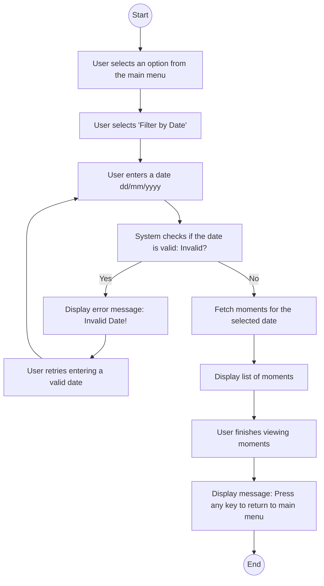

# Patient Management System for Veterinary Clinic

## Project Description
This project is a patient management system designed for Margarita's veterinary clinic, specializing in the care of cats and dogs. The application allows for the management of patients, appointments, and treatments, maintaining a detailed and organized record. It is built using Java and the Spring Boot framework.

---

## Features
- **Patient Management**:
  - Add, update, list, and delete patient records.
  - Each patient profile includes:
    - Name
    - Age
    - Breed
    - Gender
    - Identification number
    - Owner's full name
    - Owner's phone number
  - Access patient data by identification number.

- **Appointment Management**:
  - Schedule, update, list, and delete appointments.
  - Each appointment includes:
    - Date and time
    - Patient
    - Type of appointment (standard/urgent)
    - Reason for the appointment
    - Appointment status (pending/completed).

- **Treatment History**:
  - View the history of treatments for each patient.

- **Optional Features**:
  - Add images to patient profiles using Firebase Storage.
  - User registration and management.

---

## Technical Requirements
- Built with **Java** and **Spring Boot**.
- Data stored in either an in-memory database (**H2**) or a Dockerized **MySQL** instance.
- Implements Object-Oriented Programming (OOP) principles:
  - Encapsulation
  - Layered architecture (controllers, services, repositories).
- Includes **DTOs** for data transfer.
- 70% test coverage:
  - Unit tests for models, services, and controllers.
- Dockerized for easy deployment.

---

## Getting Started

### Prerequisites
- Java 21 or higher
- Docker (optional for MySQL setup)
- Maven

### Installation
1. Clone the repository:
   ```bash
   git clone https://github.com/<your-username>/patient-management-system.git
   cd patient-management-system```

### Activity diagram
 

